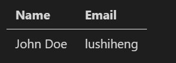

<h1 align ="center">MarkDown文档怎么写</h1>

# `#`代表标题 1

```md
# this is an h1
```

# `*`或者`_`代表斜体

```md
_This text_ is explanatory note
```

<!-- Horizontal Rule -->

# `---`代表横向分隔符

```md
---
---
```

# `~~`代表删除线

```md
~~This~~ is strikethrough
```

# `**`双星号表示强调

```md
**This** is another paragraph.
```

# `[名字](url)`添加超链接

```md
This is a link to [Google](https://google.com).
```

# ``

```md
This is an image 
```

# ` ``` `添加代码

```js
console.log("你好");
```

# `-`表示列表

```md
This is a list

- Item 1
- Item 2
- Item 3
```

# `>`表示目录

```md
> This is a quote
```

# `|`写列表

```md
| Name     | Email     |
| -------- | --------- |
| John Doe | lushiheng |
```



# `details和summary`添加下拉列表

<details>

<summary>Example Code</summary>

```js
console.log("你好");
```
